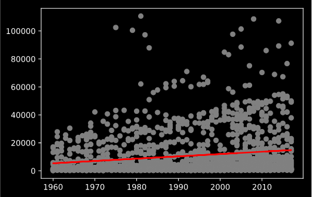

# DS5500 Homework 2

## Problem 2

For this question, I chose to take a look at the following visualization:

https://github.com/akhil-vader/DS5500/blob/master/HW1.pdf

The problem for the visualization we are looking at asked to look at income distribution across countires over time. The first major difference between our approaches is the chart type which we chose to use. I elected to leverage a map to try and display the data while this user chose to leverage a line chart to dsplay the temporal data. 

One of the benefits of the leveraging a line chart for this problem is that it is quite easy to visualize the time series data, where you can follow years along the X axis. This definitely made it easy to read and interpret the chart and also be able to show the difference in income growth across continents. The only drawback in this chart is the challenge of being able to show differences at the country level as it is just too many categories of data to show with a line chart. This is the benefif of the map chart that I leveraged as it is easier to visualize the large number of countries. However, the map chart is not as easy to interpret when looking at the time series nature of the data. 

This chart is successful at showing the relationship between income across continents over time in a clear and concise way but does not quite effectively show the same at the country level since data across counties is aggregated and displayed in one chart.

## Problem 3

For this question, I chose to look at the following visualization:

https://github.com/tonytontian/DS5500/tree/master/hw1

THe problem for the visualization we are looking at asked to display the relationship between GDP, life expectancy, and child mortality. This user chose to leverage a dynamic bubble chart with a sliding scale for time. This is a really nice was of being able to display the multiple dimensions of this data. I chose to leverage multiple charts to display the data independtly and then a set of pairwise plots to display the relationships between them. The challenge on this problem was handling the multiple dimesnsions, which is why I initally chose to look at the dimensions independently, especially given the difference in measurement scales between the dimensions. 

This chart attempted to combine all into a single chart. The visualization successfully diaplays all dimension types within the one chart but their are a few things thatI believe need to be updated to make the visualization a little bit easier to interpret. I think it may have helped to adjust the child mortality scale as the scale is a little misleading given that it would seem that child mortality would be a percentage but the scale goes to 400. It is also unclear what the sizing of the bubbles represtents, but given the question I assume it is sized by GDP. It would also be helpful to see the legend so we can see what the colors designate. 

Overall, the visualization is successful in displaying the information and is a really nice way of displaying all of the different data types and dimensions in one dynamic chart.

## Problem 4

Assessing the relationship between income and life expectancy over time.

### Simple Linear Regression

Initially, I took a look at the relationship between income (gdp per capita) to life expectancy directly. I leveraged a simple linear regression to better understand the relationship between the two variables over time.

#### gdp ~ time

Clearly their is a positive correlation between year and income (gdp per capita). When looking at the coefficient for year, it suggests that for each year their is a ~$165 increase in GDP

#### life expectancy ~ time

The coefficient for life expectancy suggests that life expectancy increases by .27 years for each year passed.

### Multivariate Regression

For comparing all three variables at once, I leveraged mutlivariate regression.

#### life expectancy ~ gdp + time

| Variable  |      Coefficients    | 
|----------|:-------------:|
| Year |  .215447
| GDP Per Capita |   .000326   

The coefficients from the model suggest that for each year incresae life expectancy increases by .22 years when holding GDP constant 

#### gpd ~ life expectancy + time

| Variable  |      Coefficients    | 
|----------|:-------------:|
| Year |  -99.92
| Life Expectancy |   984.90   

The coefficients from the model suggest that GDP decreases by $100 for each year when holding life exptancy constant and a one year increase in life expectancy increases GDP by $984.

It is challening to visualize mutlivariate liner regression which is why I chose to use coefficient tables to hel;p show the relationship between the mutliple variables. I used scatter plots to show the relationships between the pairwise comparison of variables. 

## Problem 5

Assessing the relationship between income and child mortality over time.

#### mortality rate ~ time

Clearly their is a negative correlation between year and mortality rate (deaths per 1000). When looking at the coefficient for year, it suggests that for each year the mortality rate is decreased by 1.5 deaths per 1000.

### Multivariate Regression

For comparing all three variables at once, I leveraged mutlivariate regression.

#### mortality rate ~ gdp + time

| Variable  |      Coefficients    | 
|----------|:-------------:|
| Year |  -1.283829
| GDP Per Capita |   -0.001289   

The coefficients from the model suggest that for each year incresae mortality rate decreases by 1.28 deaths per thousand.

#### gpd ~ mortality rate + time

| Variable  |      Coefficients    | 
|----------|:-------------:|
| Year |  -121.922741
| Mortality Rate |   -186.639764  

The coefficents table suggests that for each year increase, the mean GDP increases by $122 holding the child mortality rate constant.

 A unit increase in child mortality (death per 1,000 live births) decreases the mean GDP by $187 holding time constant.

Some of the challenges with the dataset we are leveraging in both problems is the nature of the data across countries. We have not accounted for the drastic differences in both income and mortality rates across countries that can skew the data. When looking at the data over time, their tends to be time periods in which their are dramatic changes in teh mortality rate and life expectancy, like due to modernized medicine and other advances in sanitation, etc. These advances could impact how the data is being interpreted and creating either stronger or weaker correlation between variables when time is introduced as a variable. We are also aggregating data across countries that have very different outcomes which may not be comparable. It may make sense to control or normalize based on how advanced a country is to remove extremes on both ends. 
